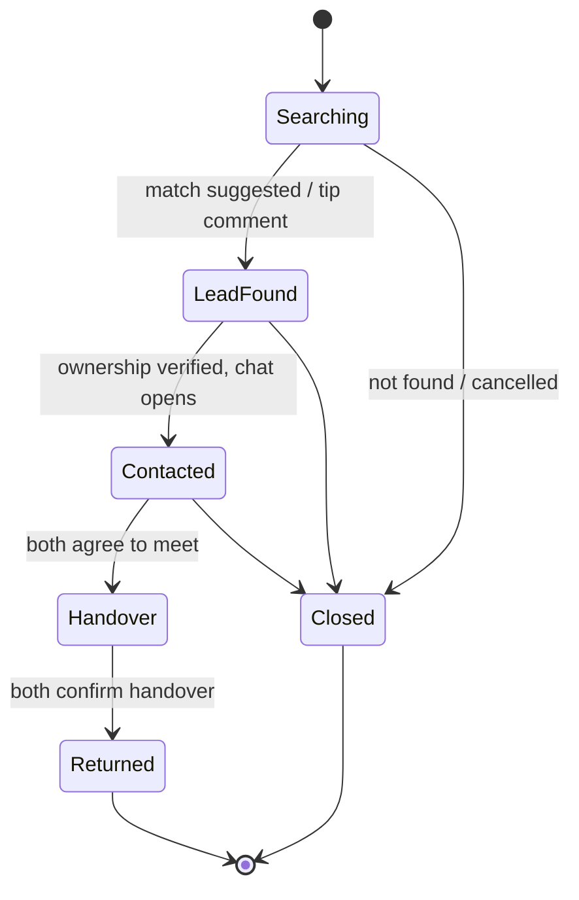

# LostLink

**A community-driven lost & found platform.**

LostLink connects two groups of people: those who **lost** something and those who **found** something. Instead of forcing users to dig through thousands of posts, the system runs a matching engine every time a new post appears and proactively pushes suggestions ("This might be your item?") to both sides.

Matching is built on three data axes — **location**, **time**, and **item attributes** — plus a layer of community trust (reputation scores, ownership verification, and moderation).

## Key features

- **LOST / FOUND posts** with flexible categories, dynamic attributes, photos.
- **Two-way matching engine** — an explainable, rule-based scorer (no ML). Hard gates on location + time + exclusive attributes narrow candidates; a weighted soft score (location, time, category, description, image) ranks the rest.
- **Ownership verification** — a finder's security question (or a contact request) must be passed before contact details are revealed and chat opens.
- **Privacy by design** — exact coordinates are never shown publicly; every location is displayed as a blurred ~200–500 m area until both sides confirm.
- **Chat & handover** with safe public meetup suggestions and a mutual "returned" confirmation that closes the post.
- **Reputation & leaderboard** — trust points and badges earned from completed handovers and reviews.
- **Area alerts (geofence)** — get notified when a new post appears in a zone you follow.
- **Moderation & anti-fraud** — reporting, review queues, escalation for stalled deals, and automated email reminders.

## Post lifecycle

A post moves through a chain of states; every transition is recorded as a milestone to build its timeline.



| State | Meaning |
| --- | --- |
| **Searching** | Post is active and participates in matching. |
| **Lead found** | A match has been suggested, or a comment points to the item. |
| **Contacted** | Both sides passed verification; the chat channel is open. |
| **Handover in progress** | Both agreed to meet and are exchanging in person. |
| **Returned** *(closed)* | Both sides confirm — or the system/Moderator confirms on their behalf — then the post is locked and reputation is awarded. |
| **Closed** *(side branch)* | The item was never found, or the post was cancelled. |

## Roles

Permissions are inherited (each higher role includes the lower ones):

| Role | Scope |
| --- | --- |
| **Guest** | Browse and filter public posts, view the leaderboard and overall stats (locations shown blurred). |
| **User** | Post and manage items, handle match suggestions, verify & chat, claim, comment, review, set area alerts, report. |
| **Moderator** | Review posts, handle reports, temporarily lock accounts, resolve escalations and confirm handovers on behalf of users. |
| **Admin** | Manage users and roles, tune algorithm thresholds & weights, manage categories/attributes, dashboards, audit logs. |

## Tech stack

- **Frontend** (`FE/`) — React 19 + Vite, React Router.
- **Backend** (`BE/`) — Node.js + Express, MongoDB (Mongoose), JWT authentication.

## Project structure

```
Project/
├─ FE/   # React + Vite web client
└─ BE/   # Express + MongoDB API
```

## Getting started

Requires Node.js 18+ and MongoDB.

```bash
# Backend
cd BE
npm install
copy .env.example .env   # (macOS/Linux: cp)
npm run seed       
npm run dev           

# Frontend
cd FE
npm install
npm run dev          
```

## Test accounts

### Role accounts (one per permission level)

| Role | Email | Password |
| --- | --- | --- |
| **Admin** | `admin@lostlink.vn` | `Admin@123` |
| **Moderator** | `mod@lostlink.vn` | `Mod@1234` |
| **User** | `user@lostlink.vn` | `User@1234` |

### Community members (authors of the sample posts)

These match the handles shown in the demo feed, leaderboard and profiles. They
all share the password **`User@1234`**.

| Handle (username) | Email | Reputation |
| --- | --- | --- |
| `minhkhoi.td` | `minhkhoi.td@lostlink.vn` | 312 |
| `hoangnam.q1` | `hoangnam.q1@lostlink.vn` | 248 |
| `baotran.sg` | `baotran.sg@lostlink.vn` | 174 |
| `ngockhanh.dn` | `ngockhanh.dn@lostlink.vn` | 141 |
| `thuylinh.hn` | `thuylinh.hn@lostlink.vn` | 96 |
| `ducanh.bk` | `ducanh.bk@lostlink.vn` | 60 |

> These are demo credentials for local testing only — never reuse them in a real deployment.

